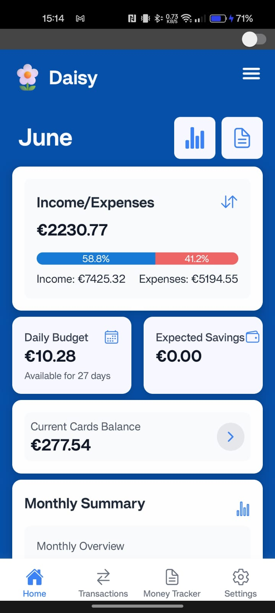
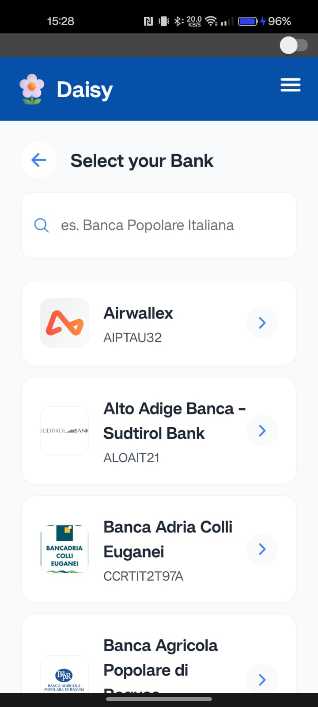
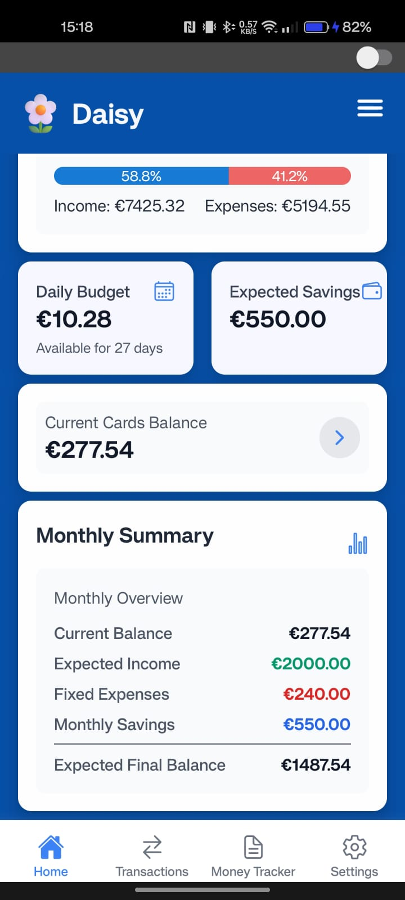
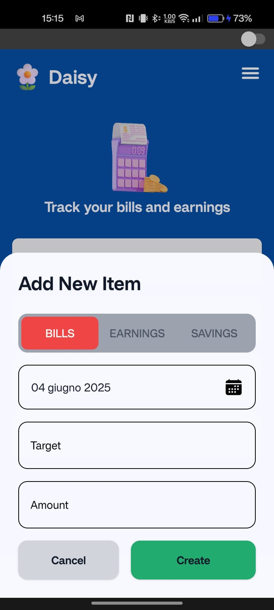
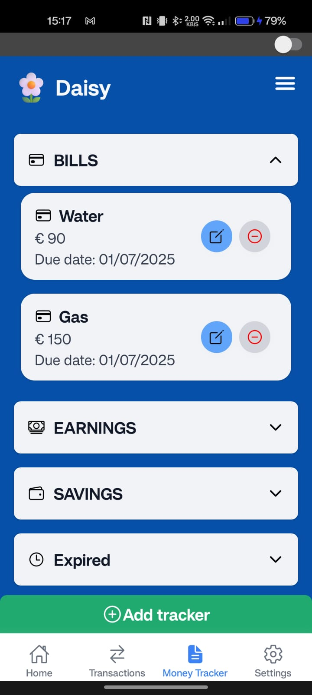
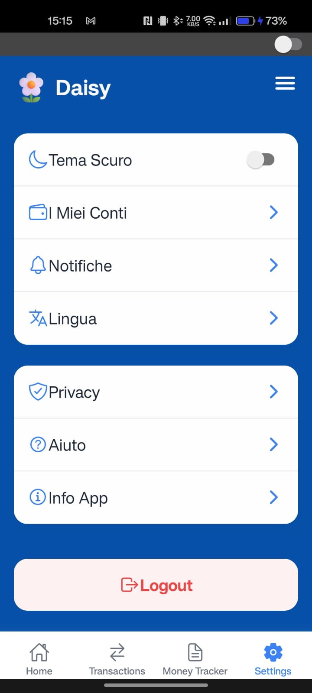

# 🧠 Smart Task & Expense Manager

## 📝 Brief Description of the App

This application is designed to simplify the management of daily tasks. It allows users to create, edit, and track their to-do lists efficiently. The intuitive interface and customizable notifications help keep users organized and productive. Additionally, the app offers synchronization across multiple devices, ensuring your data is always up-to-date and accessible from anywhere.

What truly sets this application apart is its seamless integration with open banking services. By securely connecting to the user's bank account, the app can automatically track and categorize expenses in real time, eliminating the need for manual input. This automation not only saves time but also provides valuable insights into spending habits, empowering users to make informed financial decisions. The system works quietly in the background, syncing financial data with daily tasks—offering a truly intelligent and holistic productivity experience.

---

## 📸 Screenshots

| 🔐 Login | 🏠 Dashboard | 🏦 Add Bank Account |
|:--:|:--:|:--:|
|  |  |  |

| 📆 Monthly Overview | 💳 Transactions | 📊 Tracker |
|:--:|:--:|:--:|
|  |  |  |

| ➕ Add Tracker | 🧾 Tracker Bills | ⚙️ Settings |
|:--:|:--:|:--:|
|  |  |  |

---

## 🚀 Features

- ✅ Create, edit, and manage daily tasks with ease
- 🔔 Customizable notifications to stay on track
- 🔄 Sync across multiple devices
- 🏦 Open Banking integration for real-time expense tracking
- 📈 Financial insights and categorization
- 🎯 Unified view of tasks and spending goals

---

## 🛠️ Technologies Used

### ⚙️ Backend
- 🚀 **Node.js** — Fast and scalable JavaScript runtime
- 🔥 **Express.js** — Minimal and flexible Node.js web framework
- 🗄️ **MongoDB / Mongoose** — NoSQL database with object data modeling
- 🔐 **JWT (JSON Web Token)** — Secure authentication and session management
- 🌐 **CORS** — Cross-Origin Resource Sharing configuration
- 🔄 **Nodemon** — Auto-reloading server during development
- 🔧 **Dotenv** — Environment variable and configuration management

### 🎨 Frontend
- ⚛️ **React Native** — Framework for building native apps using React
- 🧭 **React Navigation** — Declarative navigation for React Native apps
- 💅 **Styled Components** or **StyleSheet** — Component-level styling for native UI
- 📡 **Axios / Fetch API** — Efficient HTTP communication with the backend
- 🎨 **CSS / SASS** — Flexible styling with support for modular design
- ⚡ **Webpack / Vite** — Fast bundlers and development tools
- 📦 **Yarn / npm** — Dependency and package management

### 🔗 Tools & Integrations
- 🧰 **Git & GitHub** — Version control and collaboration platform
- 🧹 **ESLint / Prettier** — Code linting and formatting for consistency
- 💳 **Open Banking API** — Real-time financial data integration for automatic expense tracking
